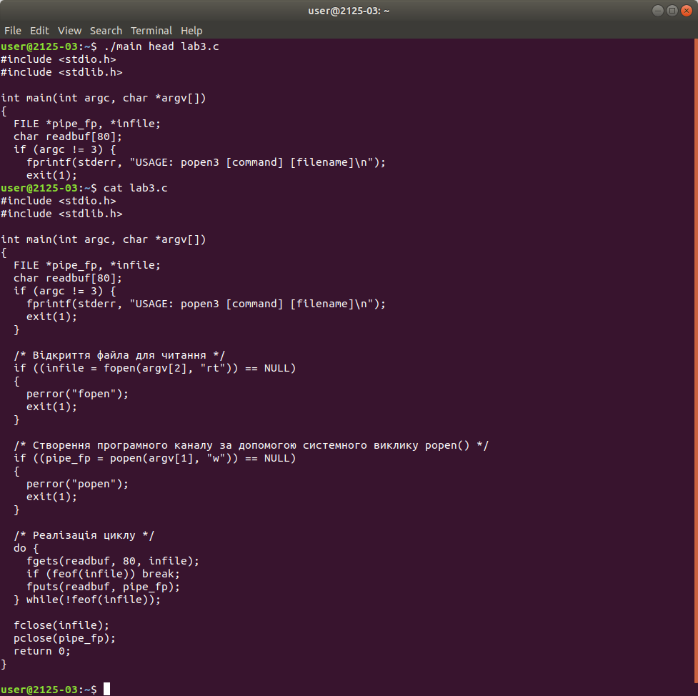

# Лабораторна робота №3:
## Тема
Знайомство з основними механізмами реалізації технології "клієнт-сервер" в ОС Unix, робота з неіменованими каналам
и### Мета:Ознайомити з основними механізмами реалізації новітніх технологій ("клієнт-сервер"), розбір програми роботи з неіменованими каналами.

